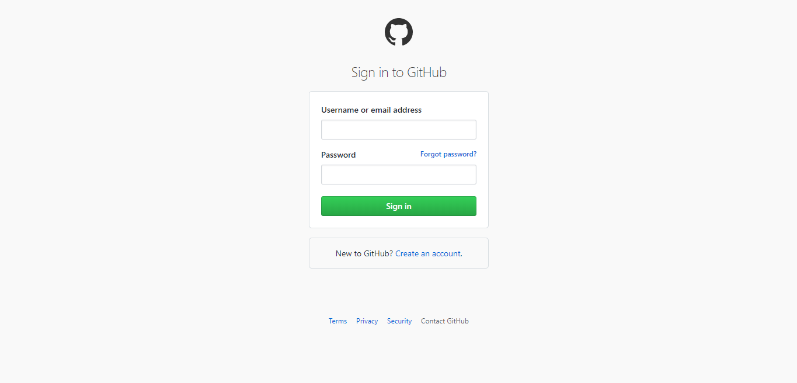

# GitHub login page



### Sobre o projeto
Este projeto visa a criação de uma página HTML simples de login baseado no login do GitHub e tem por objetivo servir como base de ensino para iniciantes no mundo da programação!

### Estrutura de Arquivos

A estrutura de arquivos é a seguinte:

```bash

├── src/
│   ├── assets/
│   |   └── page-example.png
│   └── index/
│       ├── index.html
│       ├── index.css
│       └── index.js
└── README.md
```
* **src** - Diretório contendo todos os arquivos da aplicação, é criado um diretório `src` para que o código da aplicação possa ser isolado em um diretório e facilmente portado para outros projetos, se necessário;
* **index** - Diretório para guardar os arquivos de inicialização da página.
    - **index.html** - Arquivo contendo o código HTML;
    - **index.css** - Arquivo contendo a o código de estilização;
    - **index.js** - Arquivo contendo o código da lógica;


### Linguagens utilizadas:
Para construir essa página de login foram utilizadas as linguagens HTML, CSS e JS.

1. <a href="https://www.w3schools.com/html/default.asp">HTML</a> ***(Hypertext Markup Language)*** - Linguagem de marcação utilizada para definir a estrutura (conteúdo) de uma página web. É a liguagem base da internet; 
    
    ``` html
    <!-- index.html -->

    <!DOCTYPE html>
    <html lang="pt-br">

        <head>
            <meta charset="utf-8">
            <title>Aqui vai o título da página</title>
        </head>

        <body>
            <h2>
                ... e dentro da tag "<body> </body>" todo o restante código HTML ...
            </h2>
        </body>

    </html>

    <!-- Exemplo da extrutura básica de um código html -->
    ```


2. <a href="https://www.w3schools.com/css/default.asp">CSS</a> ***(Cascading Style Sheets)*** - Linguagem usada para especificar o layout de uma página web, ou seja, como ela vai se parecer;

    ```css
    <!-- index.css -->

    body {
        background-color: lightblue;
    }

    h1 {
        color: white;
        text-align: center;
    }

    p {
        font-family: verdana;
        font-size: 20px;
    }

    <!-- Exemplo de um arquivo .css -->
    ```

3. <a href="https://www.w3schools.com/js/default.asp">JS</a> ***(JavaScript)*** - Usado para definir como uma página web deve funcionar, ou seja, com a linguagem JS é que vamos programar o comportamento (lógica) da nossa página!

    * ###### O código JS pode ser escrito diretamente no HTML como segue;
        ``` html 
        <!-- index.html -->

        <!DOCTYPE html>
        <html lang="pt-br">

            <!-- A tag script serve para encapsular o código js -->
            <script>
                function minhaFuncao() {
                    // document.getElementById("meuTexto").innerHTML faz referência à tag <p id="meuTexto">...</p> com o mesmo nome."
                    document.getElementById("meuTexto").innerHTML = "Outro texto qualquer!";
                }
            </script>

            <head>
                <meta charset="utf-8">
                <title>Minha página web!</title>
            </head>

            <body>
                <h2>JavaScript no Body</h2>
                <!-- Quando a função "minhaFuncao() é disparada o valor atribuído à tag <p id="meuTexto">...</p> dentro do corpo da função é carregado"  -->
                <p id="meuTexto">Um texto qualquer...</p>

                <button type="button" onclick="minhaFuncao()">Clique aqui!</button>
            </body>

        </html
        ```

    * ###### Ou em um arquivo .js separado
        ``` js
        // index.js

        function minhaFuncao() {
            document.getElementById("demo").innerHTML = "Outro texto qualquer!";
        }

        // Exemplo de um arquivo .js
        ```

        ###### e posteriormente referênciado no HTML.
        ``` html
        <!-- index.html -->

        <!DOCTYPE html>
        <html lang="pt-br">

            <script src="minhaFuncao.js"></script>

            <head>
                <meta charset="utf-8">
                <title>Minha página web!</title>
            </head>

            <body>
                <h2>External JavaScript</h2>

                <p id="demo">Um texto qualquer...</p>

                <button type="button" onclick="minhaFuncao()">Clique aqui!</button>

                <p>
                    (A função foi escrita em um arquivo .js externo chamado de "minhaFuncao.js")
                </p>
            </body>

        </html>
        ```
Ref: https://developer.mozilla.org/pt-BR/docs/Aprender/Getting_started_with_the_web/JavaScript_basico